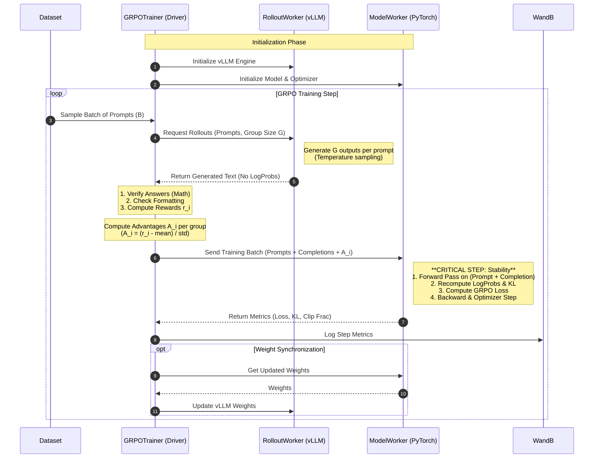

# ReasonRL

> **A simple, decoupled Reinforcement Learning framework for reasoning tasks, powered by Ray and vLLM.**

[English](README.md) | [中文](README_zh-CN.md)

ReasonRL is a minimalist implementation of **Group Relative Policy Optimization (GRPO)** designed for **learning and experimentation**. It uses **Ray actors** to cleanly decouple training and inference, making the codebase **easy to read and modify** while still supporting modern tools like vLLM.

This project is built for educational purposes and is aligned with the experiments in **CS336 (Spring 2025) Assignment 5**, focusing on code clarity and ease of use.

---

## 🚀 Key Features

*   **Simple & Powerful**: Built with the "nano" spirit—minimal abstraction, maximum readability.
*   **Ray + vLLM**: Efficiently separates training (PyTorch) and inference (vLLM) actors.
*   **Optimized for Consumer Hardware (Learning Friendly)**:
    *   **Single GPU All-in-One**: Uniquely designed to fit both **Training** (Actor) and **vLLM Inference** (Rollout) on a single 24GB GPU (e.g., RTX 3090/4090).
    *   **Dual GPU Support**: Supports splitting training and inference across 2 GPUs for improved performance.
    *   *Note: Currently optimized for 1 or 2 GPU setups. Large-scale multi-node distribution is not the focus.*
*   **Advanced GRPO Implementation**:
    *   **3 Advantage Modes**: `raw`, `grpo` (std-normalized), and `grpo_no_std` (mean-centered).
    *   **Asymmetric Clipping**: Separate `clip_range_left` and `clip_range_right` parameters for fine-grained control.
    *   **Granular Loss**: Support for both `token`-level and `sequence`-level loss aggregation.
*   **Production Ready**: Integrated with **WandB** for logging and visualization.

---

## 🛠️ Installation & Usage

We strongly recommend using **`uv`** for dependency management. It automatically handles virtual environments and package installation.

### 1. Training with `uv` (Recommended)

You can run the training script directly. `uv` will automatically create the environment and install dependencies defined in `pyproject.toml`.

```bash
# This command automatically installs dependencies and starts training
uv run train.py --config configs/grpo_config.yaml
```

*Note: You will need to log in to WandB manually beforehand if you haven't already:*
```bash
uv run wandb login
```

### 2. Manual Installation (Optional)

If you prefer `pip`:
```bash
pip install -e .
```

---

## ⚙️ Configuration Guide

The main configuration is located in `configs/grpo_config.yaml`. Here are the deep-dive details on our flexible parameters.

### 1. Resources & LoRA
Adjust these to fit your hardware. For a **single 24GB GPU** setup, use LoRA:

```yaml
model_config:
  model_name_or_path: "Qwen/Qwen2.5-Math-1.5B"
  # Allocation: 0.5 GPU for Training Actor, 0.5 GPU for Rollout Actor
  model_num_gpus: 0.5
  rollout_num_gpus: 0.5
  gpu_memory_utilization: 0.4
  use_lora: true
  lora_rank: 64
```

### 2. Advantage Estimation (`advantage_config`)
We support three modes for calculating advantages $A_i$:

*   **`raw`**: Use the reward directly ($A_i = r_i$). Good for pure RL if rewards are already normalized.
*   **`grpo_no_std`** (Recommended): Subtract the group mean ($A_i = r_i - \mu_{group}$). Efficient and stable.
*   **`grpo`**: Standard normalization ($A_i = \frac{r_i - \mu_{group}}{\sigma_{group} + \epsilon}$).

```yaml
advantage_config:
  mode: "grpo_no_std"  # options: raw, grpo, grpo_no_std
  advantage_eps: 1e-6
```

### 3. Loss & Asymmetric Clipping (`loss_config`)
Fine-tune the PPO-style clipping to control policy updates:

*   **`loss_level`**: 
    *   `token`: Computes loss per token, averaging over all valid response tokens.
    *   `sequence`: Averages tokens per sequence first, then averages across sequences.
*   **Clipping**: We support asymmetric clipping bounds (e.g., to penalize moving away from the reference policy more than moving towards it, or vice versa).

```yaml
loss_config:
  loss_level: "token"       # options: token, sequence
  clip_range_left: 0.2      # Lower bound: 1 - 0.2 = 0.8
  clip_range_right: 0.3     # Upper bound: 1 + 0.3 = 1.3
```

### 4. LR Scheduler (`train_config`)
Control the learning rate schedule:

*   **`lr_scheduler_type`**:
    *   `constant`: Keeps LR fixed.
    *   `cosine`: Applies cosine decay with warmup.
*   **Parameters**:
    *   `warmup_ratio`: Portion of steps for linear warmup (e.g., `0.1`).
    *   `min_lr_ratio`: End LR as a fraction of max LR (e.g., `0.1`).

```yaml
train_config:
  learning_rate: 1e-5
  lr_scheduler_type: "cosine"
  warmup_ratio: 0.03
  min_lr_ratio: 0.1
```

---

## 📊 Dataset Format

You must prepare your own data. The training script expects a **JSONL** file.

**Requirements:**
1.  **Format**: JSONL (one JSON object per line).
2.  **Fields**:
    *   `prompt`: The input text. **Crucial**: If using an Instruct/Chat model, this string **must already have the chat template applied** (e.g., `<|im_start|>user\n...<|im_end|>\n<|im_start|>assistant\n`).
    *   `ground_truth`: The reference answer (ground truth) used for reward verification.

**Example `data/train.jsonl`:**
```json
{"prompt": "<|im_start|>user\nWhat is 2+2?<|im_end|>\n<|im_start|>assistant\n", "ground_truth": "4"}
{"prompt": "<|im_start|>user\nSolve x+5=10<|im_end|>\n<|im_start|>assistant\n", "ground_truth": "5"}
```

---

### 5. Reward System & Customization

The default reward function (`reason_rl/reward/math_reward.py`) uses a **strict correctness** rule:

*   **Logic**: You get **1.0** point only if:
    1.  The format is correct (proper `<think>...</think>` and `<answer>...</answer>` tags).
    2.  The final answer matches the ground truth (verified by `math_validate`).
*   **Result**: If either condition fails, the reward is **0.0**.

**How to Customize:**
To implement your own reward logic (e.g., partial credit), create a class that follows our `RewardComputerProtocol`.

```python
# See reason_rl/core/interfaces.py for the Protocol definition
class MyCustomReward:
    def __call__(self, rollout_batch: RolloutBatch) -> RewardBatch:
        # Your custom logic here
        pass
```

All interfaces and data types are fully typed and documented in `reason_rl/core/`.

---

## 🏗️ System Architecture & Workflow

ReasonRL adopts a **Controller-Actor** architecture powered by **Ray**. This design decouples the *generation phase* (which needs high throughput and sampling speed) from the *training phase* (which needs precision and gradient computation).

### 🔄 The Logic Flow (Mermaid)



### 📖 Detailed Architecture Breakdown

The framework is split into three distinct logical components, ensuring that heavy computational tasks do not block the main control loop.

#### 1. The Orchestrator: `GRPOTrainer`
The Trainer (running on the CPU driver) is the brain of the operation. It does not perform heavy GPU computation itself. Instead, it manages the lifecycle of data:
*   **Prompt Sampling**: Loads and batches prompts from the JSONL dataset.
*   **Reward Calculation**: Since our rewards are deterministic (math correctness & regex checks), calculating them on the CPU is fast and efficient. This removes the need for a separate "Reward Model" GPU worker for this specific task.
*   **Advantage Estimation**: We implement Group Relative Policy Optimization (GRPO) directly in the trainer. By normalizing rewards *within* a group of outputs generated from the same prompt, we eliminate the need for a separate Value Function Critic, significantly reducing VRAM usage.

#### 2. The Inference Engine: `RolloutWorker` (vLLM)
We use **vLLM** for the rollout phase because it is orders of magnitude faster than standard PyTorch generation.
*   **Role**: Purely to generate text. It receives prompts and produces completions.
*   **Optimization**: We do *not* ask vLLM to return log probabilities. Extracting full log-probs from vLLM can be slow and memory-intensive. Instead, we treat the rollout phase as a "Black Box" generator that only yields the reasoning traces (Chain-of-Thought).

#### 3. The Learner: `ModelWorker` (PyTorch)
This actor handles the heavy lifting of training. It maintains the "Student" model in full precision (or BF16).
*   **Re-computation Strategy**: You might ask, *"Why do we recompute log probabilities here if we just generated the text?"*
    *   **Reason 1 (Stability)**: vLLM often uses approximations (like fp8 KV cache) for speed. Calculating the policy gradient requires precise `log_probs` derived from the *exact* weights being optimized. Mismatches can lead to numerical instability.
    *   **Reason 2 (Simplicity)**: By re-running the forward pass on the `ModelWorker`, we ensure that the computation graph for `old_log_probs` (reference) and `new_log_probs` (current policy) is generated in the same PyTorch environment, guaranteeing a valid gradient path.
*   **Gradient Updates**: It computes the GRPO loss, applies PPO-style clipping, and steps the optimizer.

#### Data Flow Summary
1.  **Prompt** $\rightarrow$ **vLLM** $\rightarrow$ **Text Traces**
2.  **Text Traces** + **Ground Truth** $\rightarrow$ **Trainer** $\rightarrow$ **Rewards & Advantages**
3.  **Text Traces** + **Advantages** $\rightarrow$ **Student Model** $\rightarrow$ **Loss & Update**

This "Generate-Evaluate-Train" loop is flexible. While designed for single-GPU efficiency (by toggling Ray actors), it conceptually supports splitting the workload across two cards (e.g., one for the student model, one for faster vLLM rollouts).

---

## 📈 Experiment Tracking & Results

We use **WandB** to track training progress in real-time. Reasoning capabilities (accuracy) and Chain-of-Thought length are monitored automatically.

| Evaluation Accuracy | Rollout Length (CoT Growth) |
|:-------------------:|:---------------------------:|
|  |  |

---

## 📂 Project Structure

Here is a quick overview of where everything lives. This project is designed to be modular and easy to read.

```text
.
├── configs/                # Configuration files (YAML)
│   └── grpo_config.yaml    # Main experiment config
├── reason_rl/              # Main package source code
│   ├── core/               # Core data structures & config definitions
│   │   └── config.py       # Pydantic/Dataclass config definitions
│   ├── workers/            # Ray Actors (The heavy lifters)
│   │   ├── model_worker.py   # Training Actor (PyTorch + PEFT/LoRA)
│   │   └── rollout_worker.py # Inference Actor (vLLM generation)
│   ├── trainer/            # Main Training Logic
│   │   └── grpo_trainer.py   # Orchestrates the GRPO loop
│   ├── advantage/          # Math formulas for Advantage Estimation
│   └── loss/               # Math formulas for GRPO Loss
├── scripts/                # Helper scripts (Data processing, etc.)
└── train.py                # Entry point script
```

### Key Components Explained for Beginners:

1.  **`configs/grpo_config.yaml`**: Start here! This is where you adjust hyperparameters (learning rate, batch size) and GPU resources.
2.  **`reason_rl/workers/`**: This is where the magic happens.
    *   **`model_worker.py`**: Handles the "Student" model. It calculates gradients and updates weights.
    *   **`rollout_worker.py`**: Handles the generation. It uses vLLM to quickly produce answers to math problems.
3.  **`train.py`**: The captain of the ship. It reads the config, launches the Ray actors, and starts the training loop.
4.  **`reason_rl/advantage/`**: Contains the math for how we score the model's answers (relative to the group).

---

## 📝 License
MIT
