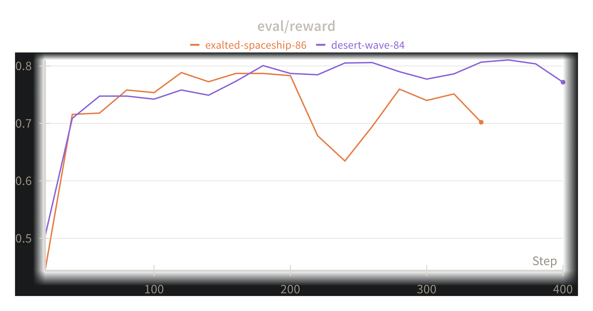
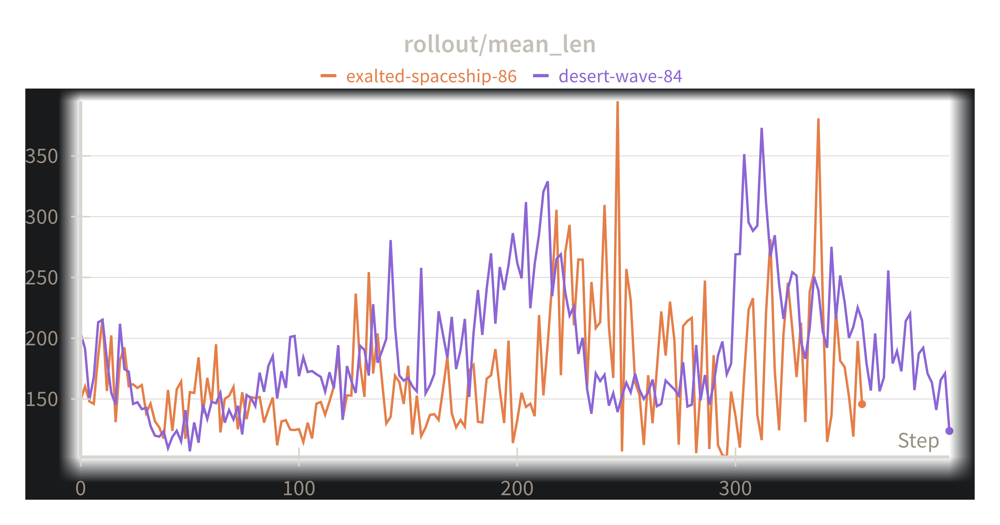
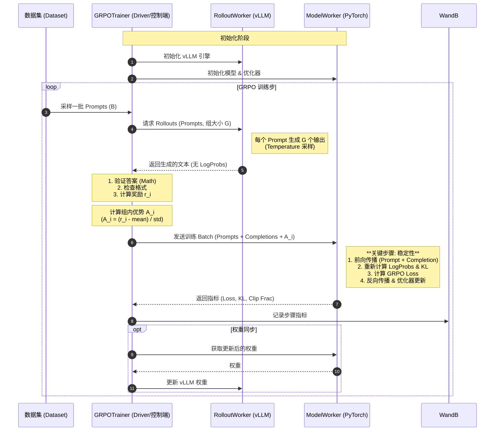

# ReasonRL

> **一个简洁、解耦的强化学习推理框架，由 Ray 和 vLLM 驱动。**

[English](README.md) | [中文](README_zh-CN.md)

ReasonRL 是 **Group Relative Policy Optimization (GRPO)** 的极简实现，专为**学习和实验**设计。它利用 **Ray actors** 干净地解耦了训练和推理过程，使得代码库在支持像 vLLM 这样现代工具的同时，依然**易于阅读和修改**。

本项目是为教育目的而构建的，与 **CS336 (2025春季) 作业 5** 的实验目标一致，专注于代码的清晰度和易用性。

---

## 🚀 核心特性

*   **简洁而强大**：秉承 "nano" 精神——最小的抽象，最大的可读性。
*   **Ray + vLLM**：高效分离训练 (PyTorch) 和推理 (vLLM) actors。
*   **针对消费级硬件优化 (学习友好)**：
    *   **单 GPU 全流程**：独特设计，可在单张 24GB GPU (如 RTX 3090/4090) 上同时运行 **训练** (Actor) 和 **vLLM 推理** (Rollout)。
    *   **双 GPU 支持**：支持将训练和推理分割到 2 张 GPU 上以提高性能。
    *   *注意：目前针对 1 到 2 GPU 的设置进行了优化。大规模多节点分布式不是本项目的重点。*
*   **高级 GRPO 实现**：
    *   **3 种优势模式**：`raw` (原始), `grpo` (标准差归一化), 和 `grpo_no_std` (去均值)。
    *   **非对称裁剪**：分离的 `clip_range_left` 和 `clip_range_right` 参数，通过非对称 PPO 裁剪实现细粒度控制。
    *   **细粒度 Loss**：支持 `token` 级别和 `sequence` 级别的 Loss 聚合。
*   **生产就绪**：集成 **WandB** 用于日志记录和可视化。

---

## 🛠️ 安装与使用

我们强烈推荐使用 **`uv`** 进行依赖管理。它可以自动处理虚拟环境和包安装。

### 1. 使用 `uv` 训练 (推荐)

你可以直接运行训练脚本。`uv` 会自动创建环境并安装 `pyproject.toml` 中定义的依赖。

```bash
# 此命令会自动安装依赖并开始训练
uv run train.py --config configs/grpo_config.yaml
```

*注意：如果你还没有登录，需要先手动登录 WandB：*
```bash
uv run wandb login
```

### 2. 手动安装 (可选)

如果你更习惯使用 `pip`：
```bash
pip install -e .
```

---

## ⚙️ 配置指南

主配置文件位于 `configs/grpo_config.yaml`。以下是我们灵活参数的详细说明。

### 1. 资源与 LoRA
根据你的硬件调整这些参数。对于 **单张 24GB GPU** 设置，请使用 LoRA：

```yaml
model_config:
  model_name_or_path: "Qwen/Qwen2.5-Math-1.5B"
  # 分配：0.5 GPU 给训练 Actor，0.5 GPU 给推理 Actor
  model_num_gpus: 0.5
  rollout_num_gpus: 0.5
  gpu_memory_utilization: 0.4
  use_lora: true
  lora_rank: 64
```

### 2. 优势估计 (`advantage_config`)
我们支持三种计算优势 $A_i$ 的模式：

*   **`raw`**：直接使用奖励 ($A_i = r_i$)。适用于奖励已经归一化的纯 RL 场景。
*   **`grpo_no_std`** (推荐)：减去组内均值 ($A_i = r_i - \mu_{group}$)。高效且稳定。
*   **`grpo`**：标准归一化 ($A_i = \frac{r_i - \mu_{group}}{\sigma_{group} + \epsilon}$)。

```yaml
advantage_config:
  mode: "grpo_no_std"  # 选项: raw, grpo, grpo_no_std
  advantage_eps: 1e-6
```

### 3. Loss 与非对称裁剪 (`loss_config`)
微调 PPO 风格的裁剪以控制策略更新：

*   **`loss_level`**：
    *   `token`：计算每个 token 的 Loss，对所有有效的 response token 求平均。
    *   `sequence`：先对每个序列求平均，然后再对 batch 中的序列求平均。
*   **Clipping**：我们支持非对称裁剪边界 (例如，惩罚远离参考策略的行为多于靠近的行为，反之亦然)。

```yaml
loss_config:
  loss_level: "token"       # 选项: token, sequence
  clip_range_left: 0.2      # 下界: 1 - 0.2 = 0.8
  clip_range_right: 0.3     # 上界: 1 + 0.3 = 1.3
```

### 4. 学习率调度器 (`train_config`)
控制学习率计划：

*   **`lr_scheduler_type`**：
    *   `constant`：先预热，然后保持 LR 不变。
    *   `cosine`：使用带预热的余弦衰减。
*   **参数**：
    *   `warmup_ratio`：线性预热步数占总步数的比例 (例如 `0.1`)。
    *   `min_lr_ratio`：结束 LR 占最大 LR 的比例 (例如 `0.1`)。

```yaml
train_config:
  learning_rate: 1e-5
  lr_scheduler_type: "cosine"
  warmup_ratio: 0.03
  min_lr_ratio: 0.1
```

---

## 📊 数据集格式

你需要准备自己的数据。训练脚本期望一个 **JSONL** 文件。

**要求：**
1.  **格式**：JSONL (每行一个 JSON 对象)。
2.  **字段**：
    *   `prompt`: 输入文本。**重要**：如果使用 Instruct/Chat 模型，这个字符串**必须已经应用了聊天模板** (例如 `<|im_start|>user\n...<|im_end|>\n<|im_start|>assistant\n`)。
    *   `ground_truth`: 参考答案 (Ground Truth)，用于奖励验证。

**`data/train.jsonl` 示例：**
```json
{"prompt": "<|im_start|>user\nWhat is 2+2?<|im_end|>\n<|im_start|>assistant\n", "ground_truth": "4"}
{"prompt": "<|im_start|>user\nSolve x+5=10<|im_end|>\n<|im_start|>assistant\n", "ground_truth": "5"}
```

---

### 5. 奖励系统与自定义

默认的奖励函数 (`reason_rl/reward/math_reward.py`) 使用**严格正确性**规则：

*   **逻辑**：只有满足以下条件才能得到 **1.0** 分：
    1.  格式正确 (有正确的 `<think>...</think>` 和 `<answer>...</answer>` 标签)。
    2.  最终答案与 Ground Truth 匹配 (经 `math_validate` 验证)。
*   **结果**：如果任一条件失败，奖励为 **0.0**。

**如何自定义：**
要实现你自己的奖励逻辑 (例如部分分)，创建一个遵循 `RewardComputerProtocol` 的类。

```python
# 协议定义见 reason_rl/core/interfaces.py
class MyCustomReward:
    def __call__(self, rollout_batch: RolloutBatch) -> RewardBatch:
        # 在这里实现你的自定义逻辑
        pass
```

所有接口和数据类型都在 `reason_rl/core/` 中有完整的类型定义和文档。

---

## 📈 实验追踪与结果

我们使用 **WandB** 实时追踪训练进度。框架会自动监控推理能力 (准确率) 和思维链长度 (CoT Length)。

| 评估准确率 (Accuracy) | Rollout 长度 (CoT 增长) |
|:-------------------:|:---------------------------:|
|  |  |

---

## 🏗️ 系统架构与工作流

ReasonRL 采用基于 **Ray** 的 **Controller-Actor** 架构。这种设计将*生成阶段*（需要高吞吐量和采样速度）与*训练阶段*（需要精度和梯度计算）解耦。

### 🔄 逻辑流程 (Mermaid)



### 📖 架构详细解析

框架分为三个独特的逻辑组件，确保繁重的计算任务不会阻塞主控制循环。

#### 1. 编排者：`GRPOTrainer`
Trainer (运行在 CPU Driver 上) 是操作的大脑。它本身不进行繁重的 GPU 计算。相反，它管理数据的生命周期：
*   **Prompt 采样**：从 JSONL 数据集中加载和批处理 Prompts。
*   **奖励计算**：由于我们的奖励是确定性的 (数学正确性 & 正则检查)，在 CPU 上计算既快又高效。这消除了为此特定任务而设置单独 "Reward Model" GPU worker 的需求。
*   **优势估计**：我们在 Trainer 中直接实现 Group Relative Policy Optimization (GRPO)。通过归一化同一 Prompt 生成的一组输出*内部*的奖励，我们消除了对单独 Value Function Critic 的需求，显著降低了 VRAM 使用。

#### 2. 推理引擎：`RolloutWorker` (vLLM)
我们使用 **vLLM** 进行 Rollout 阶段，因为它比标准的 PyTorch 生成快几个数量级。
*   **角色**：纯粹用于生成文本。它接收 Prompts 并生产 Completions。
*   **优化**：我们*不*要求 vLLM 返回 log probabilities。从 vLLM 提取完整的 log-probs 可能很慢且占用大量内存。相反，我们将 Rollout 阶段视为一个只产生推理痕迹 (思维链) 的 "黑盒" 生成器。

#### 3. 学习者：`ModelWorker` (PyTorch)
这个 Actor 处理繁重的训练任务。它以全精度 (或 BF16) 维护 "学生" 模型。
*   **重计算策略**：你可能会问，*"既然我们刚刚生成了文本，为什么还要在这里重新计算 log probabilities？"*
    *   **原因 1 (稳定性)**：vLLM 通常为了速度使用近似 (如 fp8 KV cache)。计算策略梯度需要源自*确切*被优化权重的精确 `log_probs`。不匹配可能导致数值不稳定。
    *   **原因 2 (简洁性)**：通过在 `ModelWorker` 上重新运行前向传播，我们确保 `old_log_probs` (参考) 和 `new_log_probs` (当前策略) 的计算图是在同一个 PyTorch 环境中生成的，保证了有效的梯度路径。
*   **梯度更新**：它计算 GRPO Loss，应用 PPO 风格的裁剪，并执行优化器步进。

#### 数据流摘要
1.  **Prompt** $\rightarrow$ **vLLM** $\rightarrow$ **文本痕迹**
2.  **文本痕迹** + **Ground Truth** $\rightarrow$ **Trainer** $\rightarrow$ **奖励 & 优势**
3.  **文本痕迹** + **优势** $\rightarrow$ **学生模型** $\rightarrow$ **Loss & 更新**

这个 "生成-评估-训练" 循环是灵活的。虽然它是为单 GPU 效率设计的 (通过切换 Ray actors)，但它在概念上也支持将工作负载分配到两张卡上 (例如，一张用于学生模型，一张用于更快的 vLLM rollouts)。

---

## 📂 项目结构

快速概览项目文件的位置。本项目设计为模块化且易于阅读。

```text
.
├── configs/                # 配置文件 (YAML)
│   └── grpo_config.yaml    # 主实验配置
├── reason_rl/              # 主包源代码
│   ├── core/               # 核心数据结构 & 配置定义
│   │   └── config.py       # Pydantic/Dataclass 配置定义
│   ├── workers/            # Ray Actors (重活累活都在这)
│   │   ├── model_worker.py   # 训练 Actor (PyTorch + PEFT/LoRA)
│   │   └── rollout_worker.py # 推理 Actor (vLLM 生成)
│   ├── trainer/            # 主训练逻辑
│   │   └── grpo_trainer.py   # 编排 GRPO 循环
│   ├── advantage/          # 优势估计的数学公式
│   └── loss/               # GRPO Loss 的数学公式
├── scripts/                # 辅助脚本 (数据处理等)
└── train.py                # 入口脚本
```

### 关键组件解释 (新手向)：

1.  **`configs/grpo_config.yaml`**：从这里开始！这里调整超参数 (学习率, batch size) 和 GPU 资源。
2.  **`reason_rl/workers/`**：魔法发生的地方。
    *   **`model_worker.py`**：处理 "学生" 模型。它计算梯度并更新权重。
    *   **`rollout_worker.py`**：处理生成。它使用 vLLM 快速生成数学问题的答案。
3.  **`train.py`**：这艘船的船长。它读取配置，启动 Ray actors，并开始训练循环。
4.  **`reason_rl/advantage/`**：包含我们如何根据组内表现给模型答案打分的数学逻辑。

---

## 📝 License
MIT
