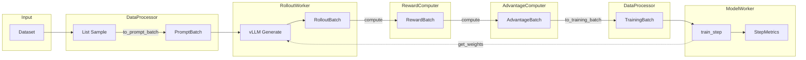

# nano-RL 项目总结

## 整体数据流



---

## 数据类型流转

| 阶段 | 类型 | 说明 |
|------|------|------|
| 数据集输出 | `List[Sample]` | prompt + ground_truth |
| vLLM 输入 | `PromptBatch` | tokenized prompts（无 padding） |
| vLLM 输出 | `RolloutBatch` | 分组的 rollout 结果 |
| Reward 计算 | `RewardBatch` | rollout + rewards |
| Advantage 计算 | `AdvantageBatch` | 展开的样本 + normalized advantage |
| 训练输入 | `TrainingBatch` | padded tensors |
| 训练输出 | `StepMetrics` | loss, lr, gradient_norm |

---

## 已完成 ✅

### Core 模块 (`nano_rl/core/`)

| 文件 | 内容 | 状态 |
|------|------|------|
| [config.py](file:///mnt/data/ganzehua/nano-RL/nano_rl/core/config.py) | `ModelConfig`, `GenerationConfig`, `TrainConfig`, `RLConfig` | ✅ |
| [types.py](file:///mnt/data/ganzehua/nano-RL/nano_rl/core/types.py) | 所有数据类型定义 | ✅ |
| [interfaces.py](file:///mnt/data/ganzehua/nano-RL/nano_rl/core/interfaces.py) | 所有 Protocol 定义 | ✅ |
| [processor.py](file:///mnt/data/ganzehua/nano-RL/nano_rl/core/processor.py) | `DataProcessor` 实现 | ✅ |

### Workers 模块 (`nano_rl/workers/`)

| 文件 | 内容 | 状态 |
|------|------|------|
| [rollout_worker.py](file:///mnt/data/ganzehua/nano-RL/nano_rl/workers/rollout_worker.py) | vLLM 推理 + 权重更新 | ✅ |
| [model_worker.py](file:///mnt/data/ganzehua/nano-RL/nano_rl/workers/model_worker.py) | 模型加载、LoRA、优化器、scheduler | ⚠️ `train_step` 未实现 |

---

## 待完成 📋

### 1. ModelWorker.train_step 实现
- [ ] GRPO loss 计算（支持多种 loss_type）
- [ ] 梯度累积
- [ ] 返回 `StepMetrics`

### 2. RewardComputer 实现
- [ ] 基于 `RewardFunctionProtocol` 的 wrapper
- [ ] 支持规则 reward（format check、answer matching）

### 3. AdvantageComputer 实现  
- [ ] Group-level normalization（GRPO 核心）
- [ ] 从 `RewardBatch` 构建 `AdvantageBatch`

### 4. Trainer 主循环
- [ ] 编排 DataProcessor → RolloutWorker → RewardComputer → AdvantageComputer → ModelWorker
- [ ] 权重同步逻辑
- [ ] Checkpoint 保存
- [ ] WandB 日志

### 5. Dataset / DataLoader
- [ ] 数据集抽象
- [ ] Prompt 格式化（chat template 外部处理）

---

## 项目结构

```
nano-RL/
├── nano_rl/
│   ├── core/
│   │   ├── config.py        # 配置类
│   │   ├── types.py         # 数据类型
│   │   ├── interfaces.py    # Protocol 定义
│   │   └── processor.py     # DataProcessor 实现
│   └── workers/
│       ├── rollout_worker.py   # vLLM Worker
│       └── model_worker.py     # PyTorch Worker
├── tests/
└── pyproject.toml
```

# 个人思路
dataset的输入是jsonl的data_path，输出是List[Sample]，每个sample包含prompt和ground_truth
每个batch size，是从dataloader返回List[Sample],所以他的collate fn是无转化的返回
